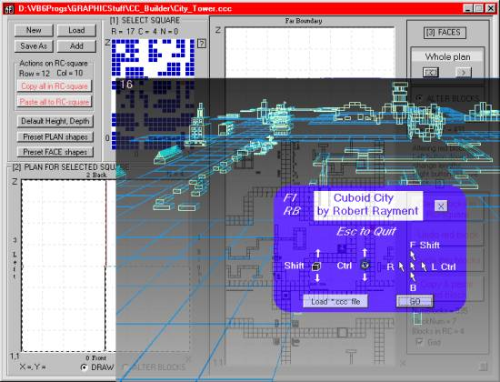



## CUBOID CITY

### Description

CUBOID CITY by Robert Rayment. Demo of what can be done with wire-frame cuboids, using pure VB & a couple of APIs for creating & animating scenes. Several thousand cuboids can be happily handled but make sure to compile the animation program!. Two progs, one to draw cuboid pictures (including random mazes) and the other to use the output files (*.ccc) and animate them. There are lots of options to help with drawing - too many to describe here. The animation program uses planar perspective for speed with mostly pure VB. Speed & direction set by distance of cursor from center of display, eye (camera) level and block heights changeable, collison detection and reaching the pyramid in the mazes explodes all. These progs provide a start for a full 3D wire-frame drawing program. Example ccc files included. See Notes. (Exe tested on WinXP) Win98. Zip 115 KB.
 
### More Info
 
Just run

Spec graphic files

             |
---                |---
**Submitted On**   |2003-12-04 17:48:10
**By**             |[Robert Rayment](https://github.com/Planet-Source-Code/PSCIndex/blob/master/ByAuthor/robert-rayment.md)
**Level**          |Intermediate
**User Rating**    |4.9 (417 globes from 85 users)
**Compatibility**  |VB 6\.0
**Category**       |[Graphics](https://github.com/Planet-Source-Code/PSCIndex/blob/master/ByCategory/graphics__1-46.md)
**World**          |[Visual Basic](https://github.com/Planet-Source-Code/PSCIndex/blob/master/ByWorld/visual-basic.md)
**Archive File**   |[CUBOID\_CIT1680991262003\.zip](https://github.com/Planet-Source-Code/robert-rayment-cuboid-city__1-50314/archive/master.zip)

### API Declarations

Not many

